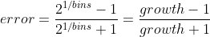
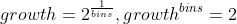

# Quantogram - Approximate Quantile calculation using Histograms

## A library for Estimating Online Quantiles of Streams

`Quantogram` accepts a stream of floating point numbers (`f64`) and estimates the desired **quantile**, such as the **median**. The caller may tradeoff storage and accuracy. The caller may choose the desired absolute relative error:

  - lowest accuracy = 17.2%
  - default accuracy = 1.0%
  - highest accuracy = 0.034%

## Installation

Add this to your Cargo.toml:
```
[dependencies]
quantogram = "0.1"
```
then you are good to go.

## Usage

The default configuration is adequate for most uses and promises a 1% worst-case error rate.

**Default Quantogram with Unweighted Samples**

This example creates a default `Quantogram`, adds some samples, and computes the count, min, max, mean, median, and third quartile (75% quantile). It also removes some samples and repeats the median.

```rust
    use quantogram::Quantogram;
    let mut q = Quantogram::new();
    q.add(10.0);
    q.add(40.0);
    q.add(20.0);
    q.add(30.0);
    q.add(50.0);

    assert_eq!(q.count(), 5);
    assert_eq!(q.min().unwrap(), 10.0);
    assert_eq!(q.max().unwrap(), 50.0);
    assert_eq!(q.mean().unwrap(), 30.0);
    assert_eq!(q.median().unwrap(), 30.0);
    assert_eq!(q.quantile(0.75).unwrap(), 40.0);

    q.remove(10.0);
    q.remove(20.0);
    assert_eq!(q.median().unwrap(), 40.0);
```

**Use QuantogramBuilder to set accuracy**

This example creates a `Quantogram` using a `QuantogramBuilder`, sets its accuracy to 0.5%, adds a list of samples in bulk, and computes the median.

```rust
    use quantogram::{QuantogramBuilder,Quantogram};
    let mut q = QuantogramBuilder::new()
                .with_error(0.005)
                .build();
    let data = vec![10.0,40.0,20.0,30.0,50.0];
    q.add_unweighted_samples(data.iter());
    assert_eq!(q.median().unwrap(), 30.0);
```

**Working with Weighted Samples**

This example begins by adding unweighted samples (which are assigned a weight of one) then adds in a heavily weighted zero sample.

```rust
    use quantogram::{Quantogram};
    let mut q = Quantogram::new();
    let data = vec![1.0,2.0,3.0,4.0,5.0,95.0,96.0,97.0,98.0,99.0];
    q.add_unweighted_samples(data.iter());
    q.add_weighted(0.0, 6.0);
    assert_eq!(q.median().unwrap(), 2.0); 
```

**Dealing with Gaps in data**

If there is a large gap in the data at the point where the desired quantile falls, it is proper to average the value below and above the gap to get the quantile. The `median` and `quantile` methods do not attempt this, but `fussy_quantile` does. For example, the following sequence has an even number of elements, so the median is supposed to be the average of the two middle values, 5 and 95, yielding 50, a number not even close to any of the values in the set:
```
 Samples = { 1,2,3,4,5,95,96,97,98,99 }
```

```rust
    use quantogram::{Quantogram};
    let mut q = Quantogram::new();
    let data = vec![1.0,2.0,3.0,4.0,5.0,95.0,96.0,97.0,98.0,99.0];
    q.add_unweighted_samples(data.iter());
    assert_eq!(q.fussy_quantile(0.5, 2.0).unwrap(), 50.0); 
```

## Configurable Memory Usage

The upper limit on storage required for the highest accuracy is 500x that of the lowest accuracy and 29x that of the default accuracy. One can choose any value for error rate that falls in the range above.

The storage is affected by how many histogram bins each power of two range of values is divided into. Few bins gives a coarse result while many bins gives a fine result. Storage is linearly proportional to the number of bins chosen. 



The growth factor indicates that each bin is wider than the previous bin in an exponential way.



For example, if `bins` is 35 then `growth` is 1.02 and `error` is 1%.

| Bins | Error Rate |
| :--- | ---------: |
|    2 |    17.2 %  |
|    3 |    11.5 %  | 
|    4 |     8.6 %  | 
|    5 |     6.9 %  | 
|    7 |     4.9 %  | 
|   12 |     2.9 %  | 
|   18 |     1.9 %  | 
|   35 |     1.0 %  | 
|   70 |     0.5 %  |
|  139 |     0.25%  |
|  347 |     0.10%  |
|  694 |     0.05%  |
|  867 |     0.04%  |
| 1000 |     0.0347%|

To halve the error rate you need to double the number of bins (and double the storage).

The maximum storage requirement is approximately this (setting aside a few configuration properties in the structure and overhead imposed by the Skip Dictionary):

```
storage = (2 x 8-byte floats) x (2 x 254 x (bins + 1) + 7)
```

The 2 x 254 has 2 for positive and negative values and 254 for the number of powers of two between the smallest and largest magnitude numbers supported by 64-bit floats. The bins + 1 is because there are two histograms, a coarse histogram that just collects one count for the nearest power of two and a fine histogram that divides each power of two into `bins` separate counts.

However, if samples never go above a million and are only recorded to three decimal places, the 254 in the formula above could be reduced to 31.

The range of maximum storage required goes from 25 KB for 2 bins to 8.2 MB for 1000 bins. For the default of 35 bins at 1% accuracy, the storage max is about 300 KB. However, if only positive integers from one to a million were added, this would drop to 17 KB. Drop the accuracy to 5% and the memory required drops to 3.5 KB. Thus you have much flexibility in tuning the structure to achieve your goals. (Fewer bins and lower accuracy also leads to faster performance.)

## Features

**Any quantile**. Some algorithms require you to choose the target quantile before you start collecting the data. This structure permits the querying of any quantile and does not require you to configure it to target any particular range of phi.

**Extreme Quantiles**. Some algorithms lose accuracy when dealing with extreme quantiles (values near zero or one) and may compensate by increasing storage. `Quantogram`'s accuracy guarantee applies to all values for phi, the desired quantile. Also, its storage requirements do not change to accommodate extreme quantiles.

**Weighted Samples**. Samples may be uniformly weighted (weight = 1) or be assigned separate weights, so that weighted medians and weighted quantiles may be computed.

**Remove Samples**. Samples may be removed and the quantiles will be updated to reflect this. 

*Warning*: If the minimum or maximum value is removed, subsequent requests for the minimum or maximum (until a new extreme sample is added) may return an incorrect value. 

**Implemented Statistics**. `Quantogram` provides these basic statistics: 

 - **min**
 - **max**
 - **mean**
 - **median**
 - **quantile**
 - **mode**
 - **count**

*Notes*: 

 1. If only integer values are collected, the `mode` will be rounded to the nearest integer.
 2. If integer values in the range [-63,63] are used, a good value for mode will result. 
 3. If non-integer values are collected or integers outside this range, then the effect of non-uniform histogram bin widths will distort the `mode` and the anwswer will not be what you expect. Bins vary in size exponentially, so the `mode` will act like the mode of the log of the samples. This will skew the `mode` toward larger values, as larger numbers are part of larger bins.
 4. Most rules of thumb related to the use of histograms to estimate the mode (like **Sturges' Rule** and **Scott's Rule**) use bin counts that are much lower than what is used by `Quantogram`. It might be better to rebin by consolidating multiple adjacent bins in order to compute the `mode`. 

**Inverse Quantile**. Lookup the quantile at which a given value falls using the `quantile_at` function.

**Exceptional Values**. Infinities and NANs are counted separately and do not factor into the quantile calculation. The proportion of such values may be queried.

**Overflow and Underflow**. If infinitesmal values are not ineresting, the underflow value may be changed to treat values smaller than a threshold as zeroes. Likewise, an upper threshold may be set and all values larger in magnitude are considered infinities (positive or negative).

By compressing the dynamic range of recorded values, less storage is required and performance is enhanced.

**Special handling of Integers**. So long as only integers (samples with no fractional component) are added to the collection, requests for a quantile will round to the nearest integer.

**Exact values for sparse bins**. If only one value has been added to a certain bin, instead of the midpoint between the bin's lower and upper value being used, the exact sample value will be used.

## Categorizing the Quantogram Algorithm

Measuring quantiles of streams of data (such as the median) is an essential basic statistic in many applications. Your choices are:

  1. Accurate and fast with moderate storage requirements, limited to a dense range of values like integers
  2. Accurate and slow with high storage requirements
  3. Approximate with probabilistic guarantees of accuracy,  fast, and low storage requirements
  4. Approximate with fixed guarantees of accuracy, fast, and moderate storage requirements

**Dense histogram**. The first is ideal but has limited applicability. It is typically implemented using a list as a dense histogram with each bucket corresponding to an integer value. If all your samples are integers that fall beween zero and 10,000 (or are floats on a uniform grid with no more than 10,000 grid lines) it is the best choice, both easy to implement and efficient to use.

**Sorted list**. The second includes the naive approach, which is to gather all the data in a list, then sort it to get the quantile. To expedite, you can use **quickselect** so that you do not need to sort all the data. This approach does not work for streaming data, because the storage requirements are vast. 

**Probabilistic**. The third category has algorithms (such as variations on **Count Min Sketch**) that quarantee a given accuracy with a certain probability. A popular median estimator is called **Median of Medians**. If you know how many items N there will be, you can use **reservoir sampling** to maintain a sample set of the data and take the median of that. However, the more extreme your quantile, the larger a subset you must keep. With these algorithms, you usually get a good estimate, but there is always a chance that you get a bad estimate. Also, given the same set of data, you may get different results; the answer is not deterministic.

**Sparse Histogram**. Sparse histograms can be used to reduce the storage requirements in comparison to dense histograms when large numbers of distinct samples must be handled. The reduction in storage is offset by greater expense in storage, retrieval and update. There are clever balanced tree structures that can be used for this, but some are complicated to implement. The strategy you use for sizing your bins affects the accuracy of the results. If logarithmically sized bins are used, you can guarantee the worst case absolute relative error will not exceed what is desired. **Quantogram** falls into this category. It is deterministic and has precise guarantees for worst case accuracy, not probabilistic ones.

## Quantogram Design

Summaries are stored at three levels, enabling the algorithm to quickly home in on a small range of bins where the cumulative weights from the smallest number to the current number match the desired quantile.

 - Top level: total weight for negatives, zeroes, positives, NANs, +/- Infinity
 - Middle level: coarse counts, one for negatives and one for positives, to the nearest power of two
 - Bottom level: fine counts for all finite values

The coarse and fine counts are stored in `skip maps` (dictionaries built upon a `skip list`). They are a tree-structured index into a linked list, where keys are stored in sorted order. This makes search, insert, update and ordered iteration fast. 

By using the coarse counts in the middle level, one can sum up the weights to get near the quantile and discover which power of two range contains the quantile. Then the skip map's filtered iterator provides rapid access to that range of values in the fine dictionary.

**Fast hashing**. An important part of the algorithm is how samples are hashed to find their keys at the coarse and fine levels. At the coarse level, `frexp` is used to get the power of two and sign of the number, using an intrinsic math function instead of the math library log. At the fine level, the remaining mantissa is fed to an approximate log function to get the bin number. The approximate log uses a third-order **Padé Approximant**, which is twice as fast as the math library log.

## Performance

Two use cases were examined, one dominated by insertion and the other by the quantile computation.

**Insertion Heavy**. A million random values were added to a naive list and a `Quantogram`, then a single median was taken. In release mode, the `Quantogram` took 2.2x as long as the naive, but with dramatically lower storage. Only 577 bins actually used, which is 1/866 as much space as the naive algorithm used.

The insertion heavy scenario strongly favors the naive algorithm, because insertion is its strength, whereas the quantile computation requires a sort, but is only performed once.

**Quantile Heavy**. 20,000 random values were added to a naive list and a `Quantogram`, with a median taken after each insertion. In release mode, the `Quantogram` was 65x faster than the naive approach. As the number of samples increases, this ratio should improve further.

Profiling reveals that the bulk of the time is spent performing operations on the `SkipMap`.

